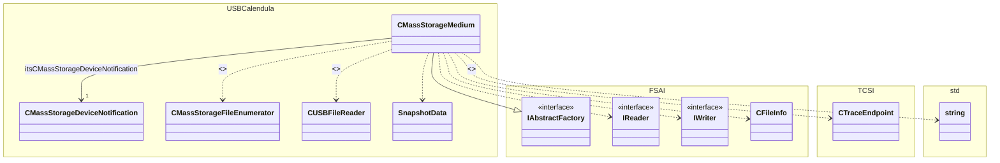

# Rhapsody Apps
Some utilities for IBM Rhapsody
TEst: 

```mermaid
classDiagram

namespace USBCalendula {
    class CMassStorageMedium
    class CMassStorageDeviceNotification
    class CMassStorageFileEnumerator
    class CUSBFileReader
    class SnapshotData
}

namespace FSAI {
    class IAbstractFactory {
        <<interface>>
    }
    class IReader {
        <<interface>>
    }
    class IWriter {
        <<interface>>
    }
    class CFileInfo
}

namespace TCSI {
    class CTraceEndpoint
}

namespace std {
    class string
}

CMassStorageMedium --|> IAbstractFactory

CMassStorageMedium --> "1" CMassStorageDeviceNotification : itsCMassStorageDeviceNotification

CMassStorageMedium ..> CMassStorageFileEnumerator : <<usage>>
CMassStorageMedium ..> CUSBFileReader : <<usage>>
CMassStorageMedium ..> CTraceEndpoint : <<usage>>

CMassStorageMedium ..> string
CMassStorageMedium ..> IReader
CMassStorageMedium ..> IWriter
CMassStorageMedium ..> CFileInfo
CMassStorageMedium ..> SnapshotData
```